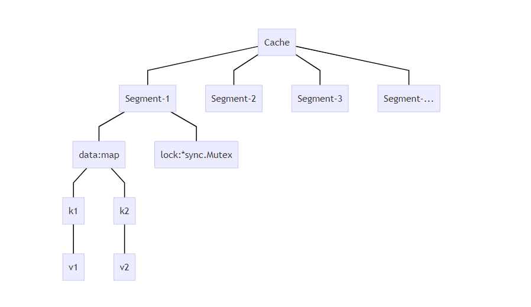

# 架构介绍
cachego 是一个拥有高性能分段锁机制的轻量级内存缓存，拥有懒清理和哨兵清理两种清理机制，可以应用于所有的 GoLang 应用程序中。

## 分段加锁
Cachego的架构如下图：


Cachego的存储结构分为两层。第一层是缓存容器（Cache）。缓存容器下属多个段（Segment）,使用自定义的哈希算法，将键值对分配到各个段中。段采用内建的map数据结构进行二次哈希，并保存到map数据结构中。

当写入操作发生时，只对该数据所属的段加锁，而不是对整个缓存容器加锁，这样可以提升并发访问的性能。

以下将Segment称为“段”，将Cache称为“缓存容器”。


## 数据生存时间与垃圾回收

数据生存时间（Time To Live, TTL）是指缓存数据进入缓存容器后的存储时间，在超过这段时间后，数据就会过期。

假设在2020年5月1日十点整将数据{"name":"李华"} 放到这个缓存容器中，并且设置TTL=60秒，那么在2020年5月1日10:01分00秒之前，这个数据是可以取出的；超过这段时间，数据就不能取出，该数据就过期了。

实现方法就是每次取值前进行判断：

```
条件： （TTL为永久）||（当前时间 - 放入数据的时间 < TTL）
```

如果判断条件为真，则可以取出；否则数据不能取出。但要注意，即便数据不能取出，它也依然存留在缓存容器里。这就要求缓存容器进行垃圾回收。

垃圾回收可以由用户调用，也可以通过缓存容器的AutoGC方法定时调用。在垃圾收集的时候，程序遍历缓存容器中所有的段，再遍历段中的所有缓存键值对，如果超过TTL，就进行删除。